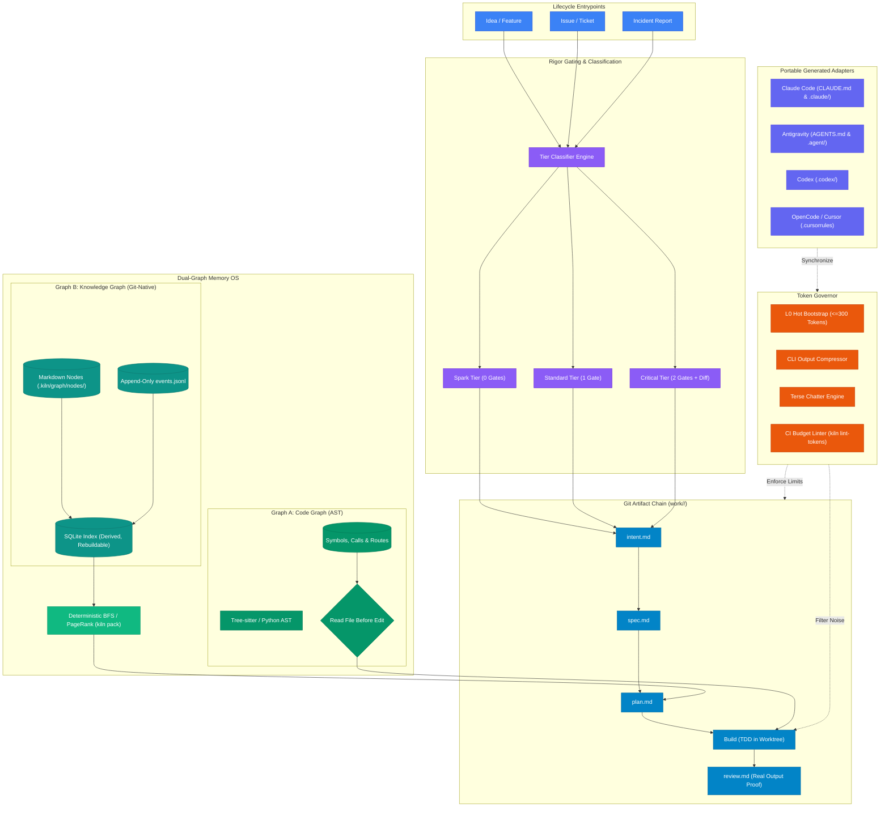

<div align="center">


*A resilient, token-minimizing operating system for AI coding agents covering the full software lifecycle.*

</div>

---

# 📝 **Description**

<div align="center">

***Kiln OS*** is a production-grade, portable operating system and execution harness for AI coding agents (**Claude Code, Codex, OpenCode, and Antigravity**).

It replaces advisory prompt prose with **deterministic git-backed artifacts, strict hook gates, a 5-tier dual-graph memory OS, and an active Token Governor**. Kiln OS ensures agent tasks are repeatable, self-healing, budgeted, and verified with pasted command execution evidence.

</div>

---

# 🏗️ **Architecture**

<div align="center">



</div>

---

# ⚡ **Core Principles**

1. **Artifact Chain in Git**: Every task lives in `work/<id>/`. Each stage reads **only** the prior artifact:
   $$\text{Intent} \longrightarrow \text{Spec} \longrightarrow \text{Plan} \longrightarrow \text{TDD} \longrightarrow \text{Review}$$
2. **Right-Size Rigor via Tiers**:
   - **Spark (Tier 0)**: 0 checkpoints (fast-track for typos, docs, cosmetic fixes).
   - **Standard (Tier 1)**: 1 design approval checkpoint before code.
   - **Critical (Tier 2)**: 2 checkpoints (Plan + Pre-merge Review) + human diff review.
3. **Deterministic Beats Advisory**: Guarantees are executable CLI hooks and safety gates, not advisory prompt prose. Security hooks fail closed.
4. **Evidence Over Claims**: Nothing is marked done without pasted command stdout evidence in `review.md`.
5. **Memory is Data, Never Instructions**: Files are ground truth; graphs are navigation aids. Memory nodes are quarantined against prompt injection.
6. **Tokens are a Budget**: Scoped reads, byte-stable bootstrap headers, output noise reduction, and CI budget linters.
7. **Resilient by Default**: Zero-loss index reconstruction from source files on corruption, and instant session restore via `kiln resume`.
8. **Portable Canonical Source**: Single canonical `.kiln/` definition with generated adapters for Claude Code, Antigravity, Codex, and OpenCode.

---

# 🚀 **Quickstart**

### 1. Installation
Clone the repository and install the Kiln OS CLI locally:
```bash
git clone https://github.com/cristiangilsanz/kilnOS.git
cd kilnOS
pip install -e .
```

### 2. Generate Harness Adapters
Compile portable adapters for your active coding agent:
```bash
kiln build-adapters
```
* Generates `CLAUDE.md` and `.claude/skills/` for **Claude Code**.
* Generates `AGENTS.md` and `.agent/skills/` for **Antigravity**.
* Generates `.codex/instructions.md` for **OpenAI Codex**.
* Generates `.cursorrules` for **OpenCode / Cursor**.

### 3. Initialize a Task
Create a new governed task from an idea:
```bash
kiln create "Implement user session token caching"
```
Kiln OS automatically:
* Classifies the rigor tier (`spark`, `standard`, or `critical`).
* Generates `work/<id>/intent.md` and `work/<id>/state.yml`.
* Stages and commits the initial artifact chain to git.

### 4. Deterministic Retrieval
Retrieve task context within a strict token budget:
```bash
kiln pack 000-kiln --budget 1500
```

### 5. Expand Knowledge Nodes
Expand full node context on demand without cluttering context windows:
```bash
kiln node dec-001
```

### 6. Health & Self-Healing
Verify graph integrity, detect stale evidence, or rebuild missing indexes:
```bash
kiln doctor
```

### 7. Resume After Context Compaction
Restore full task state and progress without re-reading the entire repository:
```bash
kiln resume 000-kiln
```

---

# 🛡️ **Safety & Resilience**

* **Fail-Closed Security Gates**:
  - `check_secrets_gate`: Blocks unredacted API keys, private keys, or tokens.
  - `check_protected_branch_gate`: Blocks direct modifications to `main` without review approval.
  - `check_tests_touched_gate`: Enforces TDD by requiring test updates whenever `src/` changes.
  - `check_prod_gate`: Enforces human approval checkpoints before release.
* **Fail-Open Helper Hooks**: Formatting and cache warmup failures emit warnings without blocking agent progression.
* **Prompt Injection Defense**: Memory nodes and tool returns are treated as untrusted data (`<kiln-untrusted-data>`), preventing prompt injection attacks from persisted history.
* **Self-Healing Index**: If `.kiln/graph/index.db` is deleted or corrupted, `kiln doctor` rebuilds it with 100% query parity from raw `.kiln/graph/nodes/*.md` and `events.jsonl`.

---

# 📊 **Repository Structure**

```text
kilnOS/
├── .github/workflows/ci.yml       # Multi-OS & Multi-Python CI matrix
├── .kiln/                         # Canonical Kiln configuration & storage
│   ├── config.yaml                # Core settings & token limits
│   ├── skills/                    # Canonical skills (kiln-pack, kiln-remember, kiln-doctor)
│   └── graph/
│       ├── nodes/                 # Git-native markdown knowledge nodes (Graph B)
│       ├── events.jsonl           # Append-only audit log
│       └── index.db               # Derived SQLite cache with FTS5 (gitignored)
├── AGENTS.md                      # L0 hot bootstrap instructions (<=80 lines)
├── CLAUDE.md                      # Claude Code adapter entrypoint
├── .cursorrules                   # OpenCode / Cursor adapter entrypoint
├── .codex/                        # OpenAI Codex adapter entrypoint
├── standards/                     # Codebase engineering standards
│   ├── index.yml                  # Conditional trigger routing (cap 5)
│   ├── tdd.md                     # Test-driven development standard
│   └── resilience.md              # Fault-tolerance & fail-closed standard
├── work/                          # Governed task artifact chains
│   └── 000-kiln/
│       ├── intent.md              # Task intent & tier classification
│       ├── spec.md                # Task architectural specification
│       ├── plan.md                # Step-by-step TDD implementation plan
│       ├── review.md              # Pasted execution proof & evidence
│       └── state.yml              # Machine-readable task state machine
├── src/kiln/                      # Core Kiln OS Python engine
│   ├── graph/                     # Schema, event logging, SQLite indexer, Code Graph AST
│   ├── retrieval/                 # Decayed BFS / PageRank context packer
│   ├── governor/                  # Token linter, CLI filter, terse rules, audit telemetry
│   ├── hooks/                     # Safety gates, helper hooks, state runner
│   ├── pipeline/                  # Task creator, gardener, incident loop closer
│   └── adapters/                  # Multi-harness adapter generators & drift detectors
├── tests/                         # Full automated test suite (39 tests)
└── evals/                         # Memory retrieval golden tests & token A/B benchmarks
```

---

# 📜 **License**

This project is licensed under the **MIT License**.
