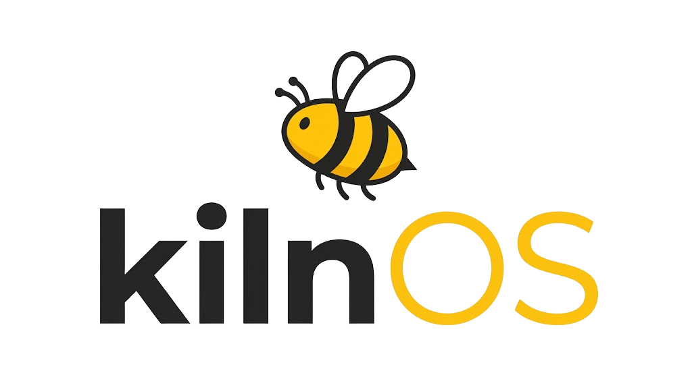
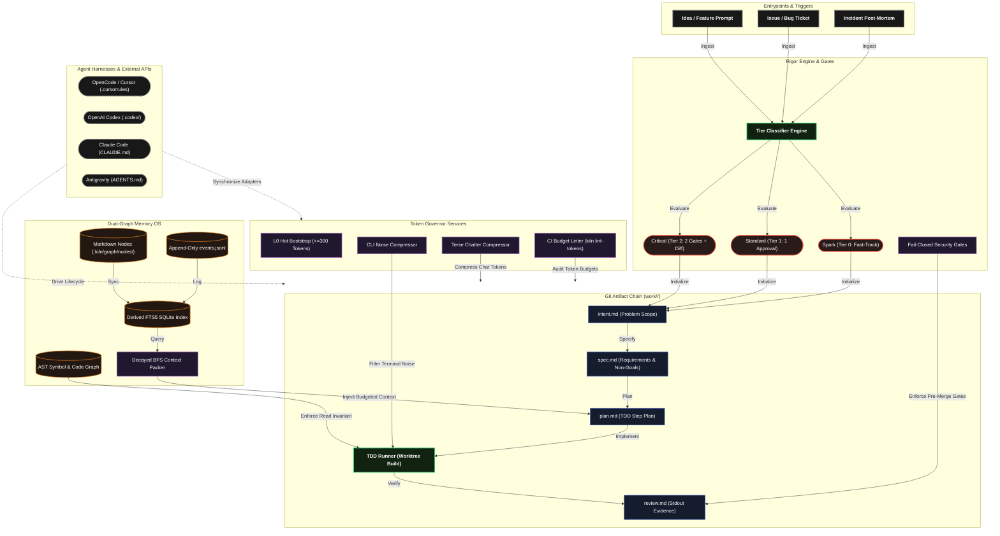

<div align="center">



![Codex](https://img.shields.io/badge/Codex-412991?logo=data%3Aimage/svg%2Bxml%3Bbase64%2CPHN2ZyB4bWxucz0iaHR0cDovL3d3dy53My5vcmcvMjAwMC9zdmciIHZpZXdCb3g9IjAgMCAyNCAyNCI%2BPHBhdGggZmlsbD0id2hpdGUiIGQ9Ik0yMi4yODIgOS44MjFhNS45ODUgNS45ODUgMCAwIDAtLjUxNi00LjkxIDYuMDQ2IDYuMDQ2IDAgMCAwLTYuNTEtMi45QTYuMDY1IDYuMDY1IDAgMCAwIDQuOTgxIDQuMThhNS45ODUgNS45ODUgMCAwIDAtMy45OTggMi45IDYuMDQ2IDYuMDQ2IDAgMCAwIC43NDMgNy4wOTcgNS45OCA1Ljk4IDAgMCAwIC41MSA0LjkxMSA2LjA1MSA2LjA1MSAwIDAgMCA2LjUxNSAyLjlBNS45ODUgNS45ODUgMCAwIDAgMTMuMjYgMjRhNi4wNTYgNi4wNTYgMCAwIDAgNS43NzItNC4yMDYgNS45OSA1Ljk5IDAgMCAwIDMuOTk3LTIuOSA2LjA1NiA2LjA1NiAwIDAgMC0uNzQ3LTcuMDczek0xMy4yNiAyMi40M2E0LjQ3NiA0LjQ3NiAwIDAgMS0yLjg3Ni0xLjA0bC4xNDEtLjA4MSA0Ljc3OS0yLjc1OGEuNzk1Ljc5NSAwIDAgMCAuMzkyLS42ODF2LTYuNzM3bDIuMDIgMS4xNjhhLjA3MS4wNzEgMCAwIDEgLjAzOC4wNTJ2NS41ODNhNC41MDQgNC41MDQgMCAwIDEtNC40OTQgNC40OTR6TTMuNiAxOC4zMDRhNC40NyA0LjQ3IDAgMCAxLS41MzUtMy4wMTRsLjE0Mi4wODUgNC43ODMgMi43NTlhLjc3MS43NzEgMCAwIDAgLjc4IDBsNS44NDMtMy4zNjl2Mi4zMzJhLjA4LjA4IDAgMCAxLS4wMzMuMDYyTDkuNzQgMTkuOTVhNC41IDQuNSAwIDAgMS02LjE0LTEuNjQ2ek0yLjM0IDguNTI4YTQuNDcxIDQuNDcxIDAgMCAxIDIuMzQ4LTEuOTcyVjEyLjFhLjc5Ljc5IDAgMCAwIC4zOTEuNjg3bDUuODQ0IDMuMzcyLTIuMDIgMS4xNjhhLjA3Ni4wNzYgMCAwIDEtLjA3MSAwbC00LjgzLTIuNzg2QTQuNTA0IDQuNTA0IDAgMCAxIDIuMzQgOC41Mjh6bTE2LjgyMiAzLjk0bC01Ljg0NS0zLjM3MiAyLjAyLTEuMTY4YS4wNzYuMDc2IDAgMCAxIC4wNzEgMGw0LjgzIDIuNzkxYTQuNDk0IDQuNDk0IDAgMCAxLS42NzYgOC4xMDV2LTUuNjc4YS43OS43OSAwIDAgMC0uNDA3LS42NzhoLjAwN3ptMi4wMS0zLjAyM2wtLjE0MS0uMDg1LTQuNzc0LTIuNzgyYS43NzYuNzc2IDAgMCAwLS43ODUgMEw5LjYzIDkuOTU3VjcuNjI1YS4wOC4wOCAwIDAgMSAuMDMzLS4wNjJsNC44NC0yLjc5NmE0LjUgNC41IDAgMCAxIDYuNjcgNC43ODR6bS0xMi42NCA0LjEzNWwtMi4wMi0xLjE2NGEuMDguMDggMCAwIDEtLjAzOC0uMDU3VjYuNzc1YTQuNSA0LjUgMCAwIDEgNy4zNzUtMy40NTNsLS4xNDIuMDgtNC43NzggMi43NThhLjc5NS43OTUgMCAwIDAtLjM5My42ODF2Ni43Mzd6bTEuMTAzLTIuMzk1bDIuNjctMS41NCAyLjY3IDEuNTR2My4wOGwtMi42NyAxLjU0LTIuNjctMS41NHoiLz48L3N2Zz4%3D)


*A resilient, token-minimizing operating system for AI coding agents covering the full software lifecycle.*

</div>

---

# 📝 **Description**

<div align="center">

***Kiln OS*** is a production-grade, portable operating system and execution harness for AI coding agents (**OpenCode, Codex, Claude Code, and Antigravity**).

It replaces advisory prompt prose with **deterministic git-backed artifacts, strict hook gates, a 5-tier dual-graph memory OS, and an active Token Governor**. Kiln OS ensures agent tasks are repeatable, self-healing, budgeted, and verified with pasted command execution evidence.

</div>

---

# 🏗️ **Architecture**

<div align="center">



</div>

---

# ⚡ **Core Principles**

1. **Artifact Chain in Git**: Every task lives in `work/<id>/`. Each stage reads **only** the prior artifact:
   $$\text{Intent} \longrightarrow \text{Spec} \longrightarrow \text{Plan} \longrightarrow \text{TDD} \longrightarrow \text{Review}$$
2. **Right-Size Rigor via Tiers**:
   - **Spark (Tier 0)**: 0 checkpoints (fast-track for typos, docs, cosmetic fixes).
   - **Standard (Tier 1)**: 1 design approval checkpoint before code.
   - **Critical (Tier 2)**: 2 checkpoints (Plan + Pre-merge Review) + human diff review.
3. **Deterministic Beats Advisory**: Guarantees are executable CLI hooks and safety gates, not advisory prompt prose. Security hooks fail closed.
4. **Evidence Over Claims**: Nothing is marked done without pasted command stdout evidence in `review.md`.
5. **Memory is Data, Never Instructions**: Files are ground truth; graphs are navigation aids. Memory nodes are quarantined against prompt injection.
6. **Tokens are a Budget**: Scoped reads, byte-stable bootstrap headers, output noise reduction, and CI budget linters.
7. **Resilient by Default**: Zero-loss index reconstruction from source files on corruption, and instant session restore via `kiln resume`.
8. **Portable Canonical Source**: Single canonical `.kiln/` definition with generated adapters for OpenCode, Codex, Claude Code, and Antigravity.

---

# 🔧 **Installation**

## 📋 Requirements

- **Python 3.10+** (or **Node.js 20+** for zero-setup `npx` execution)
- **Git 2.30+** (with worktree support enabled)
- Supported AI coding agent (**OpenCode / Cursor**, **OpenAI Codex**, **Claude Code**, or **Antigravity**)

## ⚡ Quick Start

### 1. Install Kiln OS

Install via `pip` (Python 3.10+) or run instantly via `npx` (Node.js 20+):

```bash
# Install via pip
pip install kiln-os

# Or run instantly with zero setup via npx
npx kiln-os --help
```

Or install from source for development:
```bash
git clone https://github.com/cristiangilsanz/kilnOS.git
cd kilnOS
pip install -e .
```

### 2. Generate Harness Adapters
Compile portable adapters for your active coding agent:
```bash
kiln build-adapters
```
* Generates `.cursorrules` for **OpenCode / Cursor**.
* Generates `.codex/instructions.md` for **OpenAI Codex**.
* Generates `CLAUDE.md` and `.claude/skills/` for **Claude Code**.
* Generates `AGENTS.md` and `.agent/skills/` for **Antigravity**.

### 3. Initialize a Task
Create a new governed task from an idea:
```bash
kiln create "Implement user session token caching"
```
Kiln OS automatically:
* Classifies the rigor tier (`spark`, `standard`, or `critical`).
* Generates `work/<id>/intent.md` and `work/<id>/state.yml`.
* Stages and commits the initial artifact chain to git.

### 4. Deterministic Retrieval
Retrieve task context within a strict token budget:
```bash
kiln pack 000-kiln --budget 1500
```

### 5. Expand Knowledge Nodes
Expand full node context on demand without cluttering context windows:
```bash
kiln node dec-001
```

### 6. Health & Self-Healing
Verify graph integrity, detect stale evidence, or rebuild missing indexes:
```bash
kiln doctor
```

### 7. Resume After Context Compaction
Restore full task state and progress without re-reading the entire repository:
```bash
kiln resume 000-kiln
```

---

# 🛡️ **Safety & Resilience**

* **Fail-Closed Security Gates**:
  - `check_secrets_gate`: Blocks unredacted API keys, private keys, or tokens.
  - `check_protected_branch_gate`: Blocks direct modifications to `main` without review approval.
  - `check_tests_touched_gate`: Enforces TDD by requiring test updates whenever `src/` changes.
  - `check_prod_gate`: Enforces human approval checkpoints before release.
* **Fail-Open Helper Hooks**: Formatting and cache warmup failures emit warnings without blocking agent progression.
* **Prompt Injection Defense**: Memory nodes and tool returns are treated as untrusted data (`<kiln-untrusted-data>`), preventing prompt injection attacks from persisted history.
* **Self-Healing Index**: If `.kiln/graph/index.db` is deleted or corrupted, `kiln doctor` rebuilds it with 100% query parity from raw `.kiln/graph/nodes/*.md` and `events.jsonl`.

---

# 📁 **Project Structure**

```text
kilnOS/
├── pyproject.toml
├── package.json
├── README.md                                           # You are here! ⬅️
├── .cursorrules                                        # OpenCode
├── .codex/                                             # Codex
├── CLAUDE.md                                           # Claude Code
├── AGENTS.md                                           # Antigravity
├── bin/                                                # npx
│   └── kiln.js
├── scripts/                                            # CLI shell launchers
│   ├── kiln
│   └── kiln.bat
├── .github/workflows/                                  # CI & release workflows
│   ├── ci.yml
│   └── publish.yml
├── .kiln/                                              # Canonical Kiln configuration & memory OS
│   ├── config.yaml
│   ├── templates/
│   ├── skills/
│   └── graph/
│       ├── nodes/
│       ├── events.jsonl
│       └── index.db
├── standards/                                          # Engineering guardrails & standards
│   ├── index.yml
│   ├── tdd.md
│   └── resilience.md
├── work/                                               # Governed task artifact chains
│   └── 000-kiln/
│       ├── intent.md
│       ├── spec.md
│       ├── plan.md
│       ├── review.md
│       └── state.yml
├── src/kiln/                                           # Core Kiln OS engine
│   ├── cli.py
│   ├── graph/
│   ├── retrieval/
│   ├── governor/
│   ├── hooks/
│   ├── pipeline/
│   └── adapters/
├── tests/                                              # Automated test suite (53 tests)
└── evals/                                              # Golden memory & token A/B benchmarks
```

---

# 📚 **Tech Stack**

## 🗣️ Languages

- [Python (3.10+)](https://www.python.org/)
- [JavaScript](https://developer.mozilla.org/en-US/docs/Web/JavaScript)
- [Node.js (20+)](https://nodejs.org/)

## 🧩 Frameworks & Libraries

- [SQLite3 & FTS5](https://www.sqlite.org/fts5.html)
- [PyYAML](https://pyyaml.org/)
- [pytest](https://pytest.org/)

## 🤖 Supported Agent Harnesses

- [OpenCode / Cursor](https://cursor.com/)
- [OpenAI Codex](https://openai.com/)
- [Claude Code](https://docs.anthropic.com/en/docs/agents-and-tools/claude-code/overview)
- [Google Antigravity](https://deepmind.google/)

## 🌐 Protocols & Ecosystem

- [Model Context Protocol (MCP)](https://modelcontextprotocol.io/)
- [Git Worktrees](https://git-scm.com/docs/git-worktree)
- [PyPI](https://pypi.org/project/kiln-os/)
- [npm](https://www.npmjs.com/package/kiln-os)

# 📄 **License**

This project is licensed under the MIT License - see the [LICENSE](LICENSE) file for details.

# 📞 **Get Help & Connect**

- 💬 [Start a discussion](https://github.com/cristiangilsanz/kilnOS/discussions)
- 🐛 [Open an issue](https://github.com/cristiangilsanz/kilnOS/issues)

<div align="center">
  <br>

  **Made with 💖 for the AI Coding Agent Community**

  ⭐ [Star this repo](https://github.com/cristiangilsanz/kilnOS) · 🍴 [Fork it](https://github.com/cristiangilsanz/kilnOS/fork)

  <br>

  [](https://www.buymeacoffee.com/)

</div>
